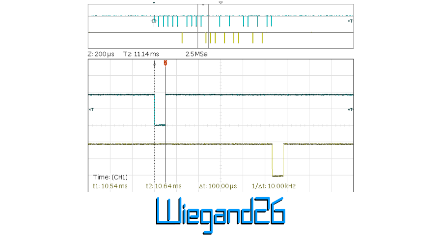
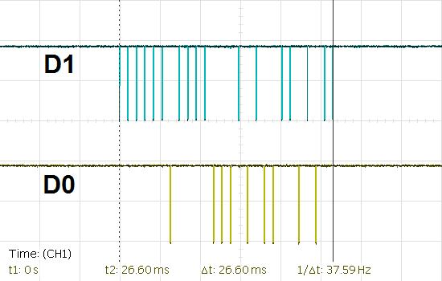
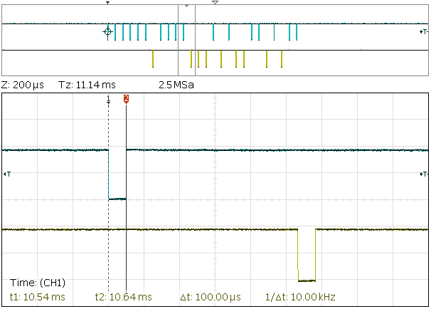
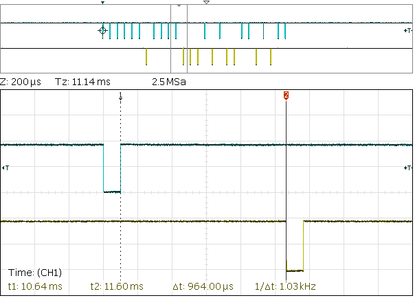

# Wiegand26

Receiving data from Wiegand26 card readers.



Card readers with Wiegand26 protocol are sending only first 3 Bytes from the card Serial number (first 16 Byte block for UID0-UID3 / MANUFACTURER).

Library is made for Arduino IDE and for Arduinos, ESP32 and ESP8266.

## Features

* Service is "waiting on backgroud" and it's fired by interupts
* _Data_ and _Status_ are served by event _(callback)_ function, it's not required function at _loop_
* _Data_ is formated as 3Byte number _(unsigned long)_
* _Status_ id formated as 1Byte number _(unsigned short int / Byte)_
* _Status_ data can be triggered manually


## Change log

* 1.0.0 - Initial release
* 1.1.0 - Swapping read Bytes of serial number for correct show

## Using

### Define

Include library, define status report and pins.

``` cpp
#include <Wiegand26.h>                            // Wiegand RFID

// Status report defines
#define       INICIALIZE      0
#define       DATA_SENDED     1
#define       CONNECTION      2
#define       LOGIC_FAULT     3
#define       RCV_TIMEOUT     4
#define       BITS_FAULTS     5
#define       PARITY_FRST     6
#define       PARITY_SCND     7

// Inicialize Wiegand26
Wiegand26 wiegand;
#define       wiegandD0       27                  // Pin for Data 0
#define       wiegandD1       26                  // Pin for Data 1
```

### Setup

Setup pins and library.

``` cpp
void setup()
{

  // Serial line
  Serial.begin (115200, SERIAL_8N1);
  Serial.setTimeout (15);
  delay (1000);

  // Wiegand RFID
  wiegand.onData (wiegandData);                   // Function for handle with data
  wiegand.onState (wiegandState);                 // Function for handle with status
  wiegand.begin(wiegandD0, wiegandD1, true);
  //            Data0      Data1      false == Send state only on change
  //                                  true  == Send state on each data reading

  // Interrupt for Wiegand data pin
  attachInterrupt(digitalPinToInterrupt(wiegandD0), wiegandPinChanged, FALLING);
  attachInterrupt(digitalPinToInterrupt(wiegandD1), wiegandPinChanged, FALLING);

}
```

### Supporting functions

Supporting function for reading pins, print status and data.

``` cpp
// Function for reading Wiegand data
void wiegandPinChanged () {
  wiegand.readData ();
}

// Print received Wiegand state
void wiegandState (uint8_t state) {
  if (bitRead (state, INICIALIZE)) {
    Serial.println ("Wiegand26 - Inicialized");
  }
  if (bitRead (state, DATA_SENDED)) {
    Serial.println ("Wiegand26 - Data sended");
  }
  if (bitRead (state, CONNECTION)) {
    Serial.println ("Wiegand26 - Disconnected");
  }
  if (bitRead (state, LOGIC_FAULT)) {
    Serial.println ("Wiegand26 - Wiring problem");
  }
  if (bitRead (state, RCV_TIMEOUT)) {
    Serial.println ("Wiegand26 - Time Out");
  }
  if (bitRead (state, BITS_FAULTS)) {
    Serial.println ("Wiegand26 - Buffer size fault");
  }
  if (bitRead (state, PARITY_FRST)) {
    Serial.println ("Wiegand26 - First parity fault");
  }
  if (bitRead (state, PARITY_SCND)) {
    Serial.println ("Wiegand26 - Second parity fault");
  }
  
}

// Print received Wiegand data
void wiegandData (unsigned long value) {

  Serial.print ("Wiegand26 - Data: 0x");
  Serial.println (value, HEX);

  Serial.print ("Wiegand26 - Data: 0b");
  Serial.println (value, BIN);

  Serial.print ("Wiegand26 - Data: ");
  Serial.println (value, DEC);

  Serial.println ();
}
```

### Main loog

If manually invoking status is required.

``` cpp
void loop() {
  
  // Manually invoke Wiegand state
  // wiegand.readState ();
  
  delay (250);

}
```

## Example

[./examples/wiegand26/wiegand26.ino][1]


## Wiegand 

The [Wiegand interface][2] is a de facto wiring standard which arose from the popularity of Wiegand effect card readers in the 1980s. It is commonly used to connect a card swipe mechanism to the rest of an access control system. The sensor in such a system is often a "Wiegand wire", based on the Wiegand effect, discovered by John R. Wiegand. A Wiegand-compatible reader is normally connected to a Wiegand-compatible security panel.

### Physical layer

The Wiegand interface uses three wires, one of which is a common ground and two of which are data transmission wires usually called DATA0 and DATA1, alternately labeled "D0" and "D1" or "Data Low" and "Data High". When no data is being sent, both DATA0 and DATA1 are pulled up to the "high" voltage level — usually +5 VDC. When a 0 is sent the DATA0 wire is pulled to a low voltage while the DATA1 wire stays at a high voltage. When a 1 is sent the DATA1 wire is pulled to a low voltage while DATA0 stays at a high voltage.



Pulse for valid data is around 100 µs long.



Gap between pulses is around 1ms.



The high signaling level of 5 VDC is used to accommodate long cable runs from card readers to the associated access control panel, typically located in a secure closet. Most card reader manufacturers publish a maximum cable run of 500 feet (150 m). An advantage of the Wiegand signaling format is that it allows very long cable runs, far longer than other interface standards of its day allowed.

### Protocol

The communications protocol used on a Wiegand interface is known as the Wiegand protocol. The original Wiegand format had one parity bit, 8 bits of facility code, 16 bits of ID code, and a trailing parity bit for a total of 26 bits. The first parity bit is calculated from the first 12 bits of the code and the trailing parity bit from the last 12 bits. However, many inconsistent implementations and extensions to the basic format exist.

Many access control system manufacturers adopted Wiegand technology, but were unhappy with the limitations of only 8 bits for site codes (0-255) and 16 bits for card numbers (0-65535), so they designed their own formats with varying complexity of field numbers and lengths and parity checking.

The physical size limitations of the card dictated that a maximum of 37 Wiegand wire filaments could be placed in a standard credit card, as dictated by CR80 or ISO/IEC 7810 standards, before misreads would affect reliability. Therefore, most Wiegand formats used in physical access control are less than 37 bits in length.


[1]: https://github.com/jvondrus/Wiegand26/blob/master/examples/wiegand26/wiegand26.ino
[2]: https://en.wikipedia.org/wiki/Wiegand_interface
